# Transparent CSS for Nautilus (GTK4)

> **For English, see [README-EN.md](README-EN.md)**

Torna o Nautilus (gerenciador de arquivos do GNOME) transparente/glass com efeito de vidro.

## Capturas de tela

| | | |
|---|---|---|
| 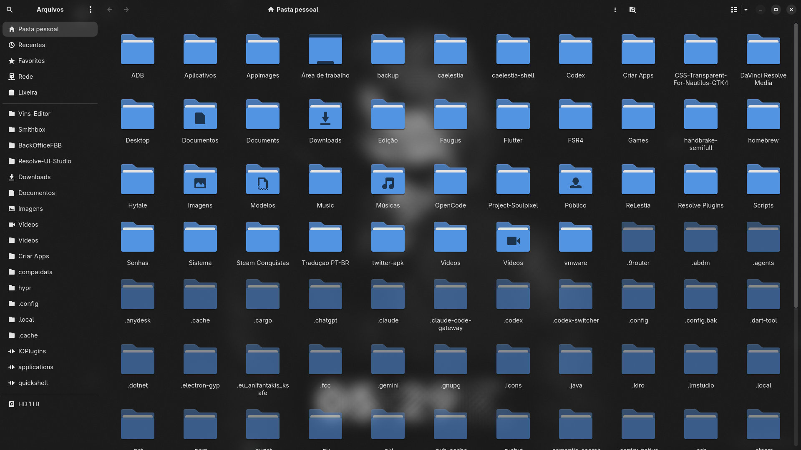 | 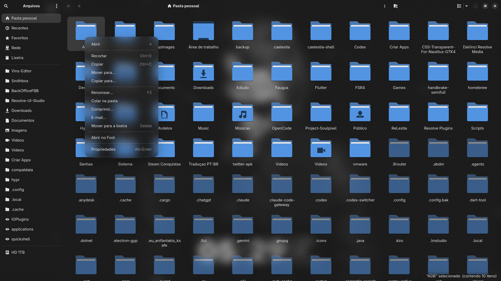 | 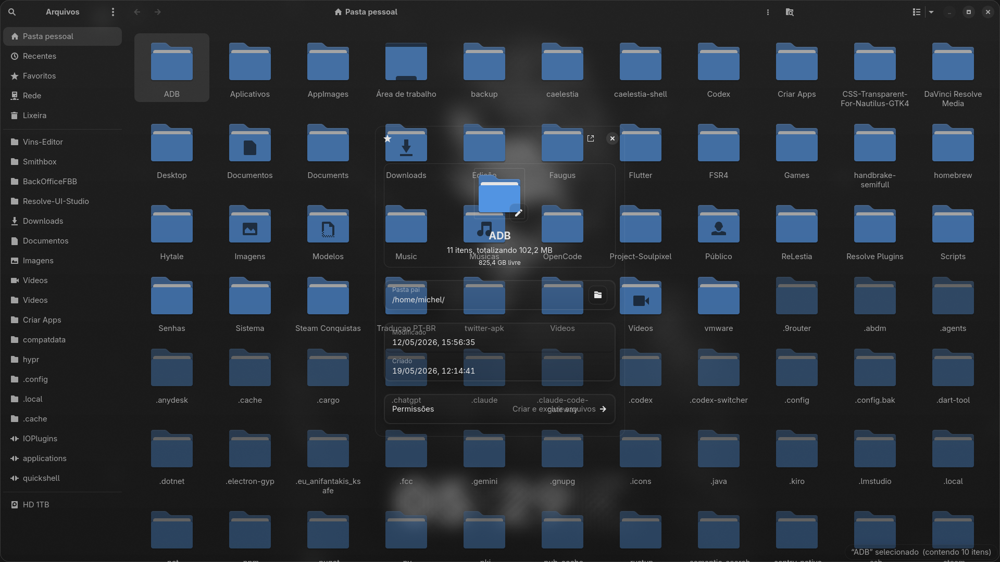 |
| 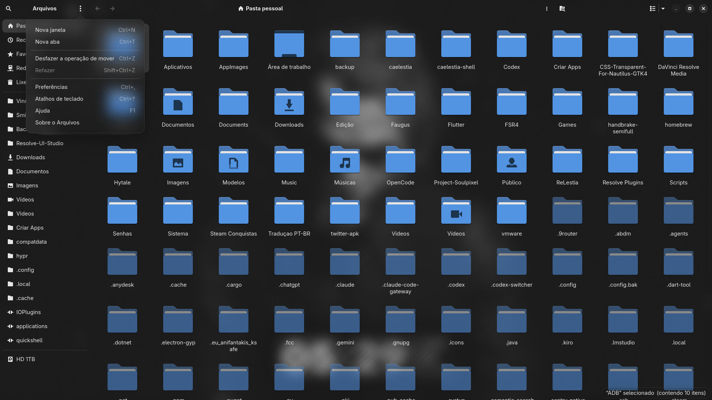 | 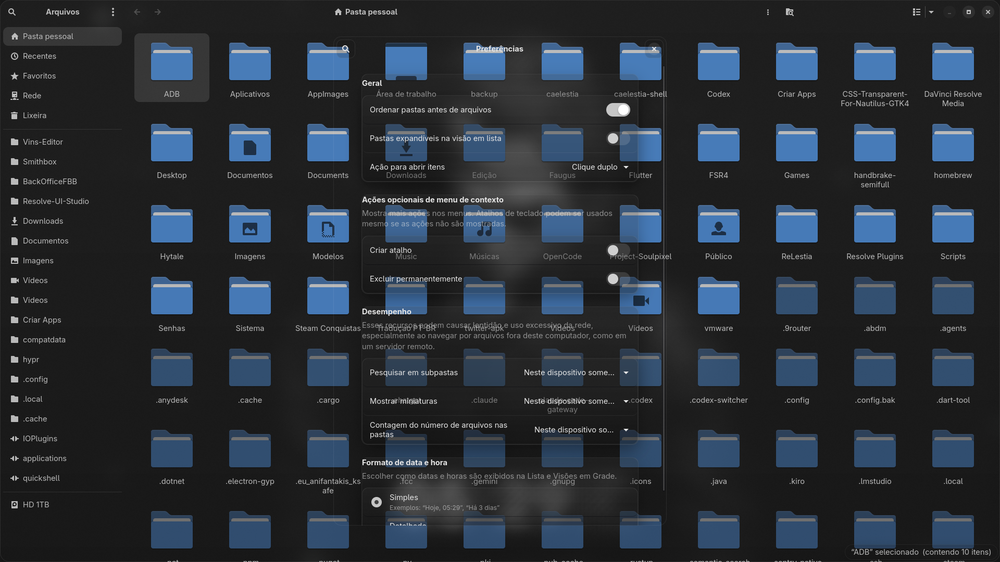 | 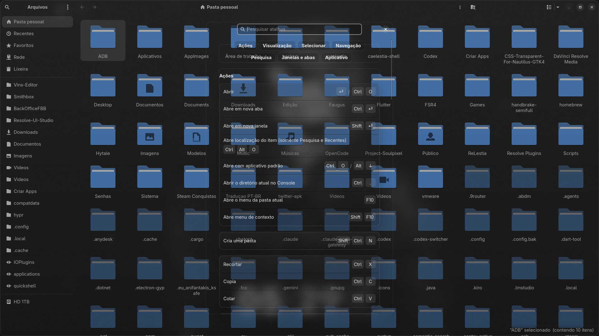 |
| 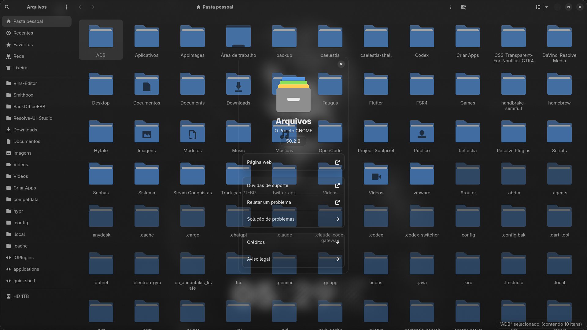 | 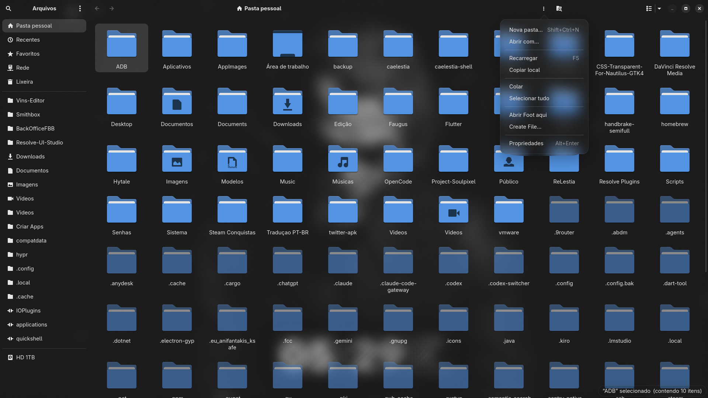 | 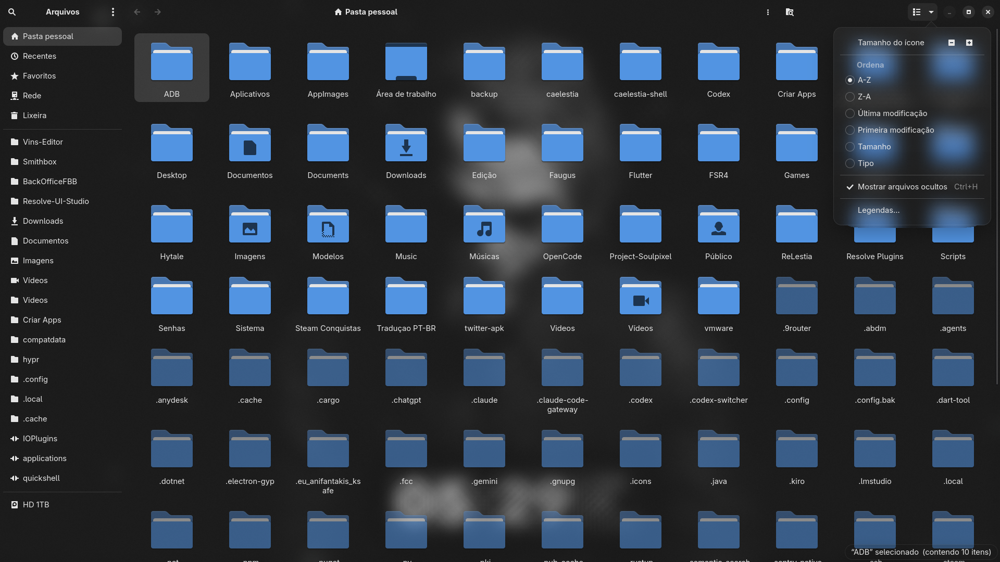 |
| 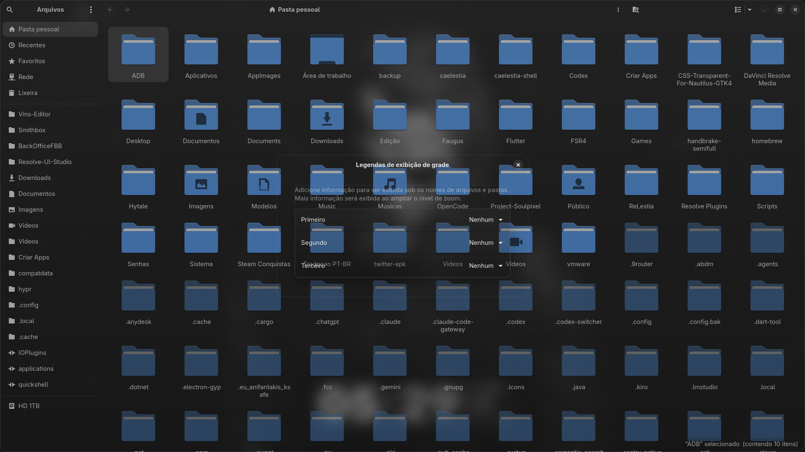 | 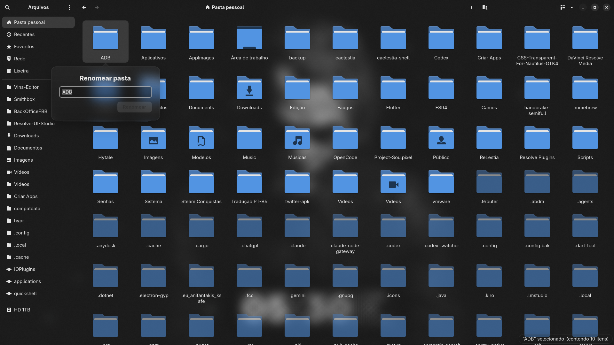 | 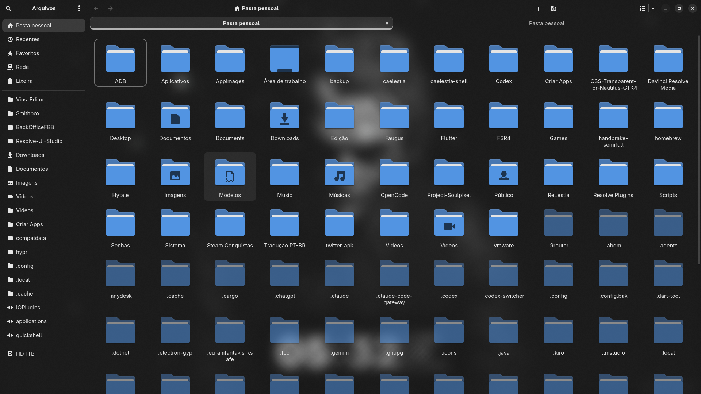 |

## Instalação

```bash
cp nautilus.css ~/.config/gtk-4.0/nautilus.css
nautilus -q && nautilus
```

O `~/.config/gtk-4.0/gtk.css` deve importar o arquivo:

```css
@import "nautilus.css";
```

## O que fica transparente

- Janela principal (grid, lista, sidebar, headerbar)
- Sidebar (`placessidebar`, `.navigation-sidebar`)
- Popovers de contexto (botão direito)
- Diálogos de Propriedades (`Adw.Dialog`)
- Caixa de diálogo Sobre (`AdwAboutDialog`)
- Caixa de diálogo Atalhos (`AdwShortcutsDialog`)
- Legendas da grade (`Adw.Dialog`)
- Barra de abas (`AdwTabBar`)
- Barra flutuante inferior (`.floating-bar`, `toast`)
- Diálogos do sistema (Lixeira, Nova Pasta, renomear)
- Janela de Preferências
- Campos de entrada (`entry`)
- Botões

## Efeito glass

Os elementos recebem:
- Fundo semi-transparente (`alpha(@window_bg_color, 0.18)`)
- Borda sutil (`alpha(@window_fg_color, 0.08)`)
- Sombra (`box-shadow`)
- Cantos arredondados (`border-radius`)
- Gradiente leve

> **Nota:** GTK4 CSS **não** suporta `backdrop-filter`. O efeito blur vem do compositor da sua DE (como GNOME/Mutter com blur opaco atrás de janelas transparentes).

## Estrutura do arquivo

| Seção | Conteúdo |
|-------|----------|
| 1 | Base transparente (janela principal) |
| 2 | Headerbar / barra superior |
| 3 | Popover / menu de contexto |
| 4 | Diálogos do sistema |
| 5 | Propriedades / popover de info |
| 6 | Toast / floating bar |
| 7 | Adw.Dialog, About, Shortcuts, Sidebar, TabBar |

## Personalização

Ajuste a opacidade alterando o valor `0.18` em:
- `alpha(@window_bg_color, 0.18)` — fundo glass
- `alpha(@window_fg_color, 0.08)` — borda

Valores maiores = mais opaco, menores = mais transparente.

## Dependências

- Nautilus (GNOME Files) GTK4
- Um compositor que suporte transparência (GNOME/Mutter, KDE/KWin, etc.)
- Tema Adwaita ou derivado (usa variáveis `@window_bg_color`, `@accent_color`, etc.)

## Inspetor ao vivo

```bash
GTK_DEBUG=interactive nautilus
```

Use `Ctrl+Shift+D` ou menu → Inspector para inspecionar nós CSS ao vivo.


---

> **English version: [README-EN.md](README-EN.md)**
